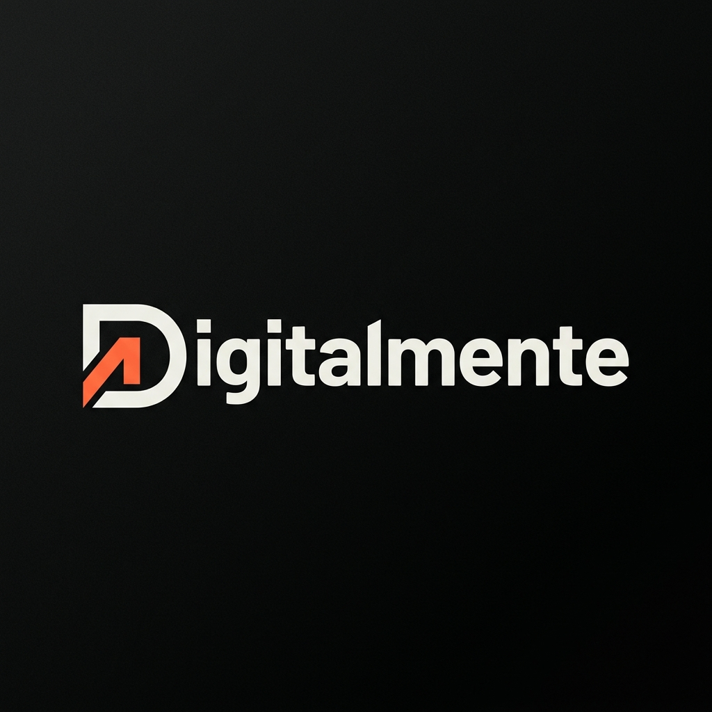

# Digitalmente — Agenzia Creativa Digitale



**Digitalmente** è il sito web di un'agenzia creativa digitale a 360° con sede a Roma. Il progetto è stato realizzato con un'estetica massimalista ed editoriale, ispirata alle riviste di design italiane di alto livello incrociate con uno studio tech all'avanguardia.

---

## 🚀 Caratteristiche

- **Design Massimalista & Editoriale** — Tipografia drammatica, layout asimmetrici, palette cromatica decisa
- **Animazioni Cinetiche** — Cursore custom, scroll reveal, parallax, tilt 3D, counter animati
- **Multi-pagina** — 8 pagine interconnesse con navigazione coerente
- **Form Multi-Step** — Modulo di contatto a 4 step per avviare un progetto
- **Portfolio Filtrabile** — Griglia dinamica con filtri per categoria
- **Responsive** — Ottimizzato per desktop, tablet e mobile
- **Performance** — Nessun framework pesante, HTML/CSS/JS puri

---

## 📁 Struttura del Progetto

```
digitalmentee/
├── index.html                  # Homepage
├── portfolio.html              # Pagina portfolio completa con filtri
├── inizia-progetto.html        # Form multi-step per nuovi progetti
├── style.css                   # Design system completo
├── main.js                     # Animazioni e interazioni
├── servizi/
│   ├── web-design.html         # Servizio: Creazione Siti Web
│   ├── social-media.html       # Servizio: Social Media Content
│   ├── marketing.html          # Servizio: Marketing Online
│   └── graphic-design.html     # Servizio: Graphic Design
└── assets/
    └── img/
        ├── logo.png            # Logo Digitalmente
        ├── portfolio-branding.png
        ├── portfolio-webapp.png
        ├── portfolio-social.png
        ├── portfolio-ecommerce.png
        ├── portfolio-campaign.png
        └── portfolio-packaging.png
```

---

## 🎨 Design System

| Token | Valore |
|-------|--------|
| **Font Display** | Outfit (100–900) |
| **Font Body** | Space Grotesk (300–700) |
| **Font Mono** | Inter (300–600) |
| **Nero** | `#0a0a0a` |
| **Accento** | `#FF6B35` (Corallo Elettrico) |
| **Accento Glow** | `#FF8C5A` |
| **Bianco** | `#f5f0eb` |

---

## 📄 Pagine

### Homepage (`index.html`)
- Hero full-screen con titolo animato e forme geometriche flottanti
- Marquee scorrevole con i servizi
- Griglia servizi interattiva (4 card con link alle pagine dedicate)
- Sezione Chi Siamo con statistiche animate
- Portfolio selezionato (6 progetti)
- CTA contatti + footer con wordmark gigante

### Portfolio (`portfolio.html`)
- Hero con breadcrumb
- Filtri per categoria: Tutti, Web Design, Brand Identity, Social Media, Marketing
- Griglia dinamica con animazioni di filtro
- CTA banner finale

### Inizia un Progetto (`inizia-progetto.html`)
- Form a 4 step con progress bar animata:
  1. **Chi sei** — Nome, email, telefono, azienda
  2. **Il progetto** — Selezione servizi, budget
  3. **Dettagli** — Descrizione, tempistiche, riferimenti
  4. **Conferma** — Riepilogo e invio

### Pagine Servizi (`servizi/*.html`)
Ogni servizio ha una pagina dedicata con:
- Hero con breadcrumb
- Introduzione con immagine
- 6 feature card animate
- Processo in 4 step
- CTA banner con link al form

---

## ⚡ Animazioni & Effetti

| Effetto | Tecnologia |
|---------|------------|
| Cursore Custom | JS + CSS `mix-blend-mode` |
| Scroll Reveal | `IntersectionObserver` API |
| Parallax Shapes | `mousemove` event |
| Tilt 3D Portfolio | `mousemove` + CSS `transform` |
| Counter Animati | `IntersectionObserver` + JS |
| Loading Screen | CSS `@keyframes` + JS |
| Grain Overlay | SVG filter inline |
| Marquee | CSS `@keyframes` infinite |

---

## 🛠️ Tecnologie

- **HTML5** — Struttura semantica
- **CSS3** — Variabili custom, Grid, Flexbox, animazioni
- **JavaScript** — Vanilla JS (nessun framework)
- **Google Fonts** — Outfit, Space Grotesk, Inter

---

## 🏃 Come Avviare

Il progetto è composto da file statici. Per visualizzarlo:

```bash
# Opzione 1: Apri direttamente nel browser
open index.html

# Opzione 2: Usa un server locale (consigliato)
npx serve .

# Opzione 3: Python
python3 -m http.server 8000
```

---

## 📋 Note

- I testi sono placeholder creativi — da aggiornare con il copy definitivo
- Il form di contatto è client-side — per la produzione integrare un servizio come Formspree, Netlify Forms o un backend custom
- Le immagini sono generate con AI — ottimizzare per la produzione (conversione in WebP/AVIF)

---

## 📍 Info

**Digitalmente** — Agenzia Creativa Digitale  
📧 ciao@digitalmente.studio  
📞 +39 06 1234 5678  
📍 Roma, Italia

---

© 2026 Digitalmente — Tutti i diritti riservati
